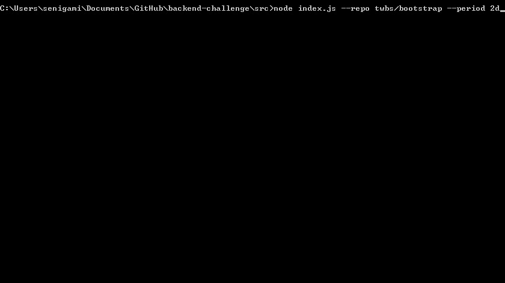

# Github Comments Count
Github has [neat statistics](https://github.com/facebook/react/graphs/contributors) for contributors, it shows number of commits and nice charts. But people contribute to Github projects not only via commits. Actually, a lot of contributions happens in issue or pull request comments 💬. Github doesn't have statistics to show "top commenters". We think those people also deserve recognition.

Fetches all existing comments for a given repository for a given period, groups by user and outputs it sorted by number of comments.

```bash
node token.js --repo anton/test-project --period 20d

  Fetching comments for past 20 days for "anton/test-project"...

  < your progress indicator here >

3012 comments, michael.davidovich (20 commits)
1345 comments, graymur (2104 commits)
   8 comments, Restuta (234 commits)  
```

## Usage
* `--repo` - name of project in owner/repo to scan ex: twbs/bootstrap
* `--period` — optional days back to scan. ex: 20d
  * if `--period` is not specified time will be infinite
  * format `25d` where `25` is number of days.

```
node token.js --repo twbs/bootstrap --period 2d
```

## Installation
You need to obtain and use your personal access token.

[Create personal access token](https://help.github.com/articles/creating-a-personal-access-token-for-the-command-line/), save it, and then use it to access API to get 5000 requests/hour.

- create `src/token/__do-not-commit-me__.js` file and add your token there like that:
```js
module.exports = '<token>'
```
- run `npm start`
- make sure you see the following output
```bash
Your github token is:
<your token>
<details of your github account>
```

## Live Example

